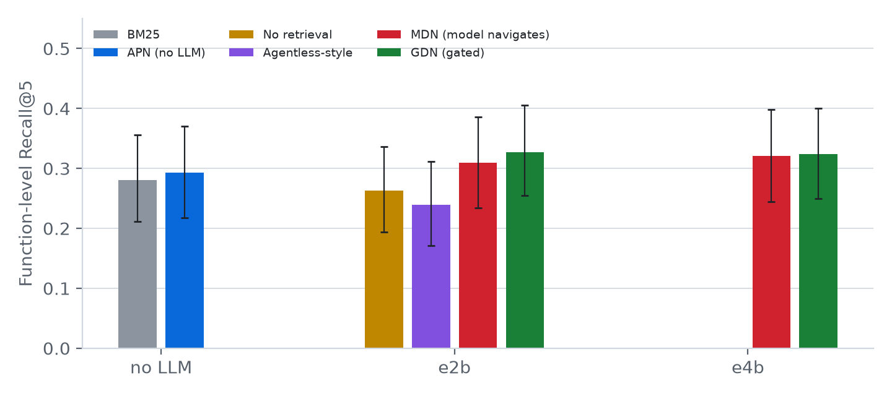
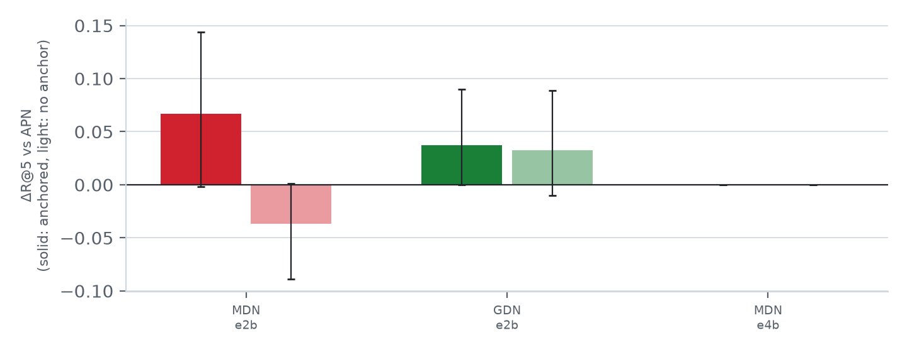
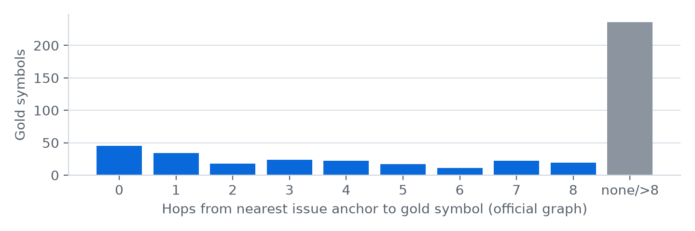

<div align="center">

# 🧭 gemma-graph-nav

### Should a small LLM navigate your code graph, or should the graph navigate for it?

**A controlled study of code-graph navigation for small Gemma 4 agents, run entirely on a 16 GB MacBook.**

[](LICENSE)


[**📄 Paper**](paper/paper.md) · [**📊 Results**](#-results) · [**⚡ Quick start**](#-quick-start) · [**🔬 Reproduce everything**](#-reproduce-every-number)

</div>

---

## 💡 The idea in 30 seconds

Coding agents increasingly use **code graphs** (who calls whom) to find the code they need to fix. Every published system lets the **LLM drive** that navigation, and tests it on big models.

On a laptop, every navigation step of a small model costs seconds. So we asked:

> **For a 2–4B model, is it better to let the model walk the graph, let a cheap graph algorithm do it, or decide case by case?**

We held the graph, tools, inputs and budgets fixed and compared **6 localization methods** on the **122 official Kaggle tasks** (fastapi, rich, requests, httpx).

## 🏆 Headline findings

| | Finding |
|---|---|
| 🎯 | **The model only helps when the issue gives it a foothold.** If the issue names a symbol that exists in the graph, Gemma 4 E4B beats the graph algorithm by **+9.5 points** of Recall@5 (95% CI +1.9 to +17.9). If not, it does **worse** (−4.2). |
| 🚦 | **Gated delegation wins.** Run the free algorithm first and call the LLM only when the algorithm is unsure. This scores the **best Recall@5 at both sizes** and uses **57% fewer tokens** than letting E4B navigate everything. |
| 🕳️ | **Half the issues give a graph nothing to grab.** 65 of 129 official issues mention no identifier that matches any graph node, which caps every graph-based method on this benchmark. |
| ❌ | **We report what failed.** Our pre-registered "the algorithm beats small models" hypothesis (H1) was *not* supported, and our uncertainty signal missed its target (AUROC 0.643 < 0.65). |

## 📊 Results

<p align="center"></p>

| Method | Model | R@1 | **R@5** | Acc@5 | LLM calls | s / task |
|---|---|---:|---:|---:|---:|---:|
| BM25 | – | .071 | .280 | .221 | 0 | ~0 |
| **Graph algorithm (APN)** | – | .125 | .293 | .238 | 0 | ~0 |
| No retrieval | E2B | .059 | .264 | .205 | 1.0 | 15.8 |
| Agentless-style | E2B | .083 | .239 | .197 | 2.0 | 29.0 |
| Model navigates (MDN) | E2B | .168 | .309 | .254 | 2.3 | 12.6 |
| 🚦 **Gated (GDN)** | E2B | .170 | **.328** | .271 | 1.3 | **5.5** |
| Model navigates (MDN) | E4B | **.196** | .321 | **.279** | 6.2 | 75.1 |
| 🚦 **Gated (GDN)** | E4B | .186 | .323 | .262 | 2.5 | 41.4 |

<sub>122 tasks, single run, T = 0, Apple M2 16 GB, Ollama 0.35.0. R@k is the share of the functions the reference fix changes that appear in the top k. Paired, repo-clustered bootstrap CIs are in the paper; no difference survives Holm correction.</sub>

### 🎯 It's all about the foothold

<p align="center"></p>

Solid bars are issues that name a symbol in the graph; light bars are issues that don't. The model is a good **local verifier around a starting point** and a poor **searcher from scratch**.

### 🕸️ How far is the bug from what the issue mentions?

<p align="center"></p>

Audit of the official competition graph: 90% of fixed symbols exist as nodes, but only 45 sit exactly where the issue points, and 236 of 499 are unreachable within 8 hops of anything the issue mentions.

## 🧠 The methods

```text
issue ─► anchors (identifiers in the issue that match graph nodes)
            │
            ├─► APN  personalized PageRank + BM25 ............ 0 LLM calls
            ├─► MDN  Gemma explores with the official graph tools (≤ 8 calls)
            └─► GDN  run APN ─► uncertain? ─► yes: MDN seeded with APN top-10 (≤ 4 calls)
                                           └─► no : return APN
```

| | What it is | Code |
|---|---|---|
| **APN** | Anchored personalized PageRank, tuned with leave-one-repo-out CV | [`src/ggd/apn.py`](src/ggd/apn.py) |
| **MDN** | Gemma using a faithful replica of the competition's `search_similar_code` / `get_code_neighbors` / `get_code_subgraph` | [`src/ggd/tools.py`](src/ggd/tools.py) |
| **GDN** | Entropy-gated delegation between the two | [`src/ggd/methods.py`](src/ggd/methods.py) |
| Baselines | BM25, static 1-hop graph, no-retrieval, Agentless-style | [`src/ggd/methods.py`](src/ggd/methods.py) |

## ⚡ Quick start

```bash
git clone https://github.com/satiricalguru/gemma-graph-nav && cd gemma-graph-nav
ollama pull gemma4:e2b-it-qat                    # 4.3 GB, runs on any 16 GB Mac
python3 scripts/sanity_benchmark.py              # 5 auto-graded probes: tools, diffs, long context
```

Pure Python standard library plus numpy. No GPU, no Docker, no API keys. Swap models with `GGD_MODEL=...`, or point at any OpenAI-compatible server with `GGD_BACKEND=openai`.

## 🔬 Reproduce every number

```bash
# Accept the rules at kaggle.com/competitions/gemma-4-developer-agent; Kaggle token in ~/.kaggle/access_token
python3 scripts/get_data_parallel.py --with-embeddings          # graphs + embeddings (~1 GB)
mkdir -p data/repos && (cd data/repos && for r in fastapi/fastapi Textualize/rich psf/requests encode/httpx; do git clone --filter=blob:none https://github.com/$r; done)
python3 scripts/prepare_tasks.py      # gold labels + graph audit
python3 scripts/tune_apn.py           # graph algorithm, leave-one-repo-out
python3 scripts/gate_cv.py            # gate threshold + H3
MODELS="gemma4:e2b-it-qat gemma4:e4b-it-qat" scripts/run_queue.sh
python3 scripts/make_tables.py && python3 scripts/analyze.py && python3 scripts/make_figures.py
python3 -m unittest discover -s tests
```

Every run logs model tag, quantization, Ollama version, git commit, seed and data hash. Sanitized per-task results are in [`results/runs`](results/runs), the full run history in [`docs/EXPERIMENT_LOG.md`](docs/EXPERIMENT_LOG.md), and the pre-registered hypotheses in [`docs/RESEARCH_DESIGN.md`](docs/RESEARCH_DESIGN.md).

> ⚠️ **16 GB Mac tip:** avoid the `*-mlx` Ollama tags. `gemma4:e4b-mlx` reserved 18 GB at a 16K context and filled the disk with swap. The `*-it-qat` tags use 5–8 GB.

<details>
<summary><b>📁 Repository layout</b></summary>

```text
src/ggd/        graph, labels, anchors+BM25, APN, tools, methods, LLM backends, stats
scripts/        data, labels/audit, tuning, experiment runner, tables, figures, Kaggle kernel
results/        audit, tuning, sanitized per-task runs, tables
paper/          paper.md + figures
docs/           research design (pre-registration), environment, experiment log
tests/          unit tests for labels, graph, ranking, metrics, stats
```
</details>

<details>
<summary><b>🚧 Limitations and what's next</b></summary>

- Single run per configuration; only E2B and E4B. 12B and 31B were prepared but not run.
- 122 tasks, mostly from fastapi and rich; localization only (no patch generation).
- Next steps: 12B/31B scale points, anchor-based gating, downstream repair.
</details>

## 📜 License and data

Code: **Apache 2.0**. Competition data is **not** included and must not be redistributed; it is downloaded by script into `data/` (git-ignored).

<div align="center"><sub>Built for the Kaggle <i>Google – The Gemma 4 Developer Agent Paper Track</i> · 2026</sub></div>
